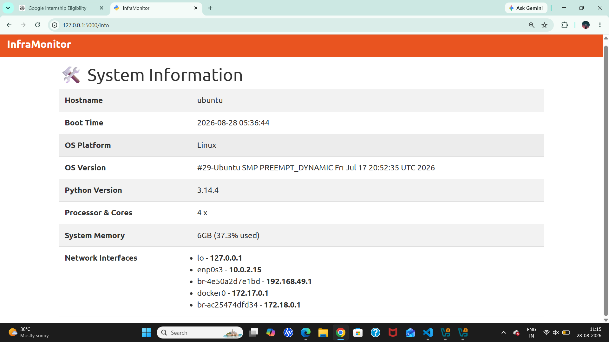
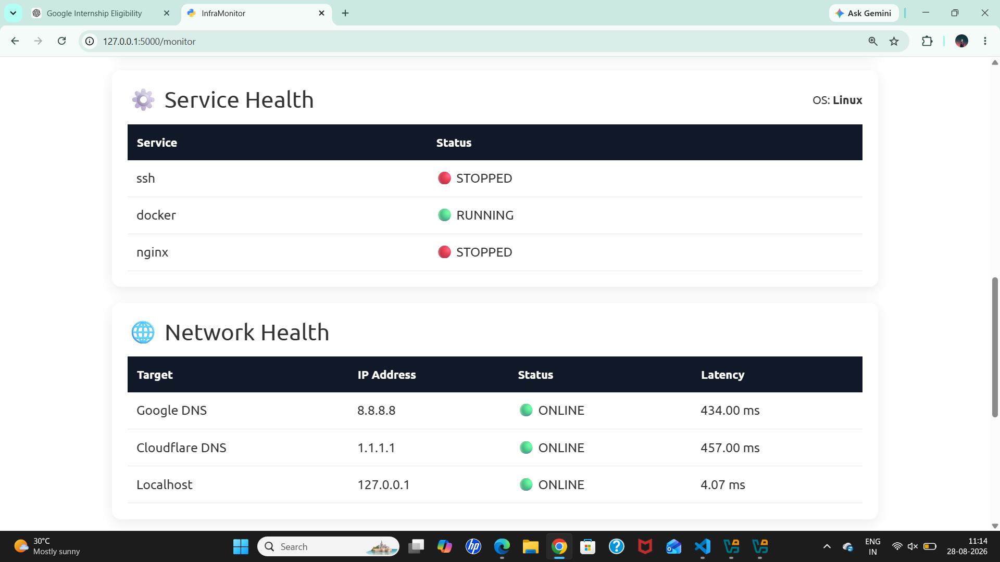

# 🚀 InfraMonitor

## Linux Infrastructure Monitoring Platform

InfraMonitor is a real-time Linux infrastructure monitoring platform built using **Python and Flask**.

It provides a browser-based dashboard to monitor system resources, running processes, network connectivity, disk and network I/O, Linux service health, and overall system status.

The project focuses on practical **Software Engineering, Python, Linux, REST API, system monitoring, testing, and Git/GitHub skills**.

---

## 📸 Application Screenshots

### 🏠 Homepage


The homepage provides an overview of InfraMonitor and provides navigation to the monitoring dashboard and system information.

---

### 📊 Monitoring Dashboard


The monitoring dashboard provides a centralized view of infrastructure health and performance.

It includes:

- System health
- CPU usage
- Memory usage
- Disk usage
- Running processes
- Linux service health
- Network health
- Performance metrics

---

### 🖥️ System Information



The system information page displays details about the Linux environment.

It includes:

- Hostname
- Boot time
- Operating system
- OS version
- Python version
- Processor information
- CPU cores
- System memory
- Network interfaces

---

### 🩺 System Health



The system health section monitors important system resources and provides status indicators for:

- CPU
- Memory
- Disk

This helps identify resource utilization and potential system issues.

---

### ⚙️ Service Health


InfraMonitor checks the status of important Linux services.

Example:

```text
SSH       STOPPED
Docker    RUNNING
Nginx     STOPPED
```
